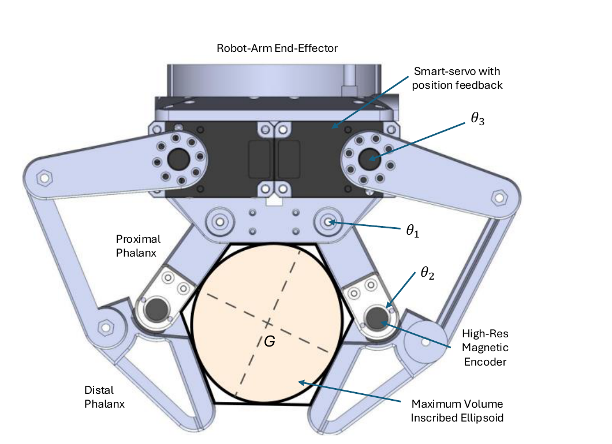

# Proprioceptive estimation of forearm roll (pronosupination, q5)

Code and data for estimating the **roll angle of the human forearm**
(pronosupination, denoted **q5**) from the **proprioceptive state of an
underactuated robotic gripper** while it grasps the forearm — i.e. from the joint
angles of the gripper's passive phalanges, without vision.

This repository supports the tactile-proprioception part of the Master's thesis:

> **Sistema multisensorial para la interacción física humano-robot**
> Rodrigo Castro Ochoa. Tutor: Jesús Manuel Gómez de Gabriel.
> Máster en Ingeniería Mecatrónica, Escuela de Ingenierías Industriales,
> Dpto. de Ingeniería de Sistemas y Automática, Universidad de Málaga, 2026.

The method is described in **Section 2.3 (theoretical framework)** and
**Section 3.4 (method)** of the thesis; the datasets here come from
**Chapter 4, Experiments 2 and 3**. A transcription of Section 2.3 is in
[`docs/section_2.3.md`](docs/section_2.3.md).

---

## 1. Idea in one paragraph

Strictly visual pose estimation cannot observe forearm pronosupination: the
detected skeleton ends at the wrist. When the robot's gripper grasps the
forearm, the cross-section of the forearm can be modelled as an **ellipse**
(Ref. [4] in the thesis: 3D scans of 6 subjects, R² 0.898–0.980, RMSE
0.21–0.64 % of the forearm circumference). The mechanical envelope formed by the
gripper's under-actuated links is a **convex contact polygon**; fitting an
ellipse inside that polygon recovers the forearm section. Doing this for the two
parallel pinches of the gripper (separated 75 mm) gives two ellipse centres,
hence the **forearm longitudinal axis** (the q5 rotation axis) and, from the
orientation of the **major diagonal of the distal ellipse**, the angle **q5**.



*Thesis fig. 3.5 — from the passive phalange angles (θ₁, θ₂) the gripper forms a
convex contact polygon; the inscribed ellipse (centre `G`) models the forearm
section. More figures in [`docs/method.md`](docs/method.md).*

Two ellipse-fitting strategies are implemented:

| Method | Idea | Notes |
|--------|------|-------|
| **John ellipse (MVIE)** | Maximum-area ellipse inscribed in the contact polygon, as a convex program `max log det(G)` s.t. `G ⪰ 0`, `‖G aᵢ‖₂ + aᵢᵀc ≤ bᵢ`. | Fast, global optimum; accuracy depends on how well the gripper accommodates the arm. Tends to over-round (low aspect ratio). |
| **Fit Anatomical** | Fit an ellipse of *known* anthropometric aspect ratio `a/b`; optimise centre `(cx,cy)`, orientation `θ (= q5)` and isotropic scale `s` with an asymmetric penalty, solved with L-BFGS-B. | Robust to sub-optimal grasps. Quantitative validation is reported in the forthcoming journal paper (see [`CITATION.cff`](CITATION.cff)). |

## 2. Repository layout

```
.
├── config/
│   └── gripper.yaml       # link lengths, pinch separation, erosion distance, solver bounds
├── code/
│   ├── acquisition/       # ROS / rosserial logging of phalange encoders + IMU ground truth
│   ├── estimation/        # the proprioceptive pipeline (importable Python package)
│   │   ├── gripper.py         # forward kinematics + contact polygon (hexagon/pentagon/rhombus)
│   │   ├── erosion.py         # morphological erosion (Minkowski difference, Shapely buffer, d = -7.5 mm)
│   │   ├── mvie.py            # maximum-area inscribed ellipse (convex optimisation, "John ellipse")
│   │   ├── fit_anatomical.py  # asymmetric-penalty anatomical fit (L-BFGS-B)
│   │   ├── forearm_axis.py    # two ellipse centres -> forearm axis, elbow & wrist localisation
│   │   └── pronosupination.py # q5 from the distal ellipse major diagonal and the {arm} frame
│   ├── processing/        # raw logs -> tidy per-trial tables
│   └── analysis/          # error analysis and figures for Experiments 2 and 3
├── data/
│   ├── raw/                   # NOT stored in this repo — see "Data" below
│   └── processed/             # regenerable tidy tables (not tracked)
├── docs/
│   ├── section_2.3.md     # transcription of the thesis section
│   ├── method.md          # full derivation: polygon -> erosion -> ellipse -> q5
│   └── protocol.md        # Experiment 2 & 3 protocols
└── results/
    ├── figures/
    └── tables/
```

## 3. Hardware / experimental setup

pHRI workstation (thesis §2.1): **Franka FR3** collaborative manipulator with an
**under-actuated gripper of two parallel pinches** designed to grasp a
participant's forearm; 4 extrinsically calibrated RGB-D cameras (eye-to-hand);
ROS Noetic. Each gripper finger: proximal phalanx **L1 = 40 mm**, distal phalanx
**L2 = 50 mm**; the two pinches are **75 mm** apart; phalange angles read by
high-resolution magnetic encoders. See [`hardware/README.md`](hardware/README.md).

Ground truth for q5: an **IMU / accelerometer** (MPU module) held by the
participant, giving the roll angle relative to the end-effector frame
(`q5_GT = atan2(a_y, a_z) − offset − π/2`), logged over `rosserial` and
synchronised in ROS. Sign convention: **positive = supination, negative =
pronation**, zero at the neutral pose.

## 4. Data

The raw per-participant recordings for Experiments 2 and 3 are **not stored in
this repository**. They are archived as a separate dataset on Zenodo under
CC-BY-4.0, with their own DOI (link added here once minted — see
[`data/README.md`](data/README.md) for the current status and the file schema).
Participants are anonymised (`P01`, `P02`, …); no identifying data is stored.
Data collected under signed informed consent with guaranteed anonymisation
(thesis §4.2).

- **Experiment 2 (discrete):** cohort of 9 (5 M, 4 F). From neutral (0°), forearm
  resting on the pinch base, static sweep in **20° increments** to maximum
  pronation and then to maximum supination; the gripper is **fully opened and
  closed between every capture** to reduce soft-tissue hysteresis. Also records
  contact-polygon feasibility (hexagon 100 %; pentagon/rhombus ≈ 80 %).
- **Experiment 3 (continuous):** continuous pronation→supination sweep with the
  gripper **closed throughout**; tactile q5 filtered with a 1-D constant-velocity
  Kalman filter (state `[q5, q5_dot]`, `Q = 0.05`); pentagon + Fit Anatomical
  with the ellipse semi-axes calibrated from the participant's real anthropometry.

## 5. Reproducing the analysis

```bash
python -m venv .venv
# Windows: .venv\Scripts\activate    |    Linux/macOS: source .venv/bin/activate
pip install -r requirements.txt

# Download the dataset from Zenodo (see data/README.md) and unpack it under
# data/raw/ before running the pipeline below.
python code/processing/build_dataset.py       # data/raw -> data/processed
python code/analysis/exp2_discrete.py         # -> results/figures, results/tables
python code/analysis/exp3_continuous.py
```

## 6. Citation

See [`CITATION.cff`](CITATION.cff).

## 7. License

- **Code:** MIT — see [`LICENSE`](LICENSE).
- **Data:** Creative Commons Attribution 4.0 International (CC-BY-4.0) — see
  [`data/LICENSE.md`](data/LICENSE.md).

## 8. Authors

Rodrigo Castro Ochoa &lt;rcastro@uma.es&gt;, Jesús Manuel Gómez de Gabriel
&lt;jesus.gomez@uma.es&gt;, Cristina Urdiales, Óscar de Cózar, Beatriz Blázquez —
TaISLab, Universidad de Málaga.

Contact: Rodrigo Castro Ochoa &lt;rcastro@uma.es&gt; · Jesús Manuel Gómez de
Gabriel &lt;jesus.gomez@uma.es&gt;.
