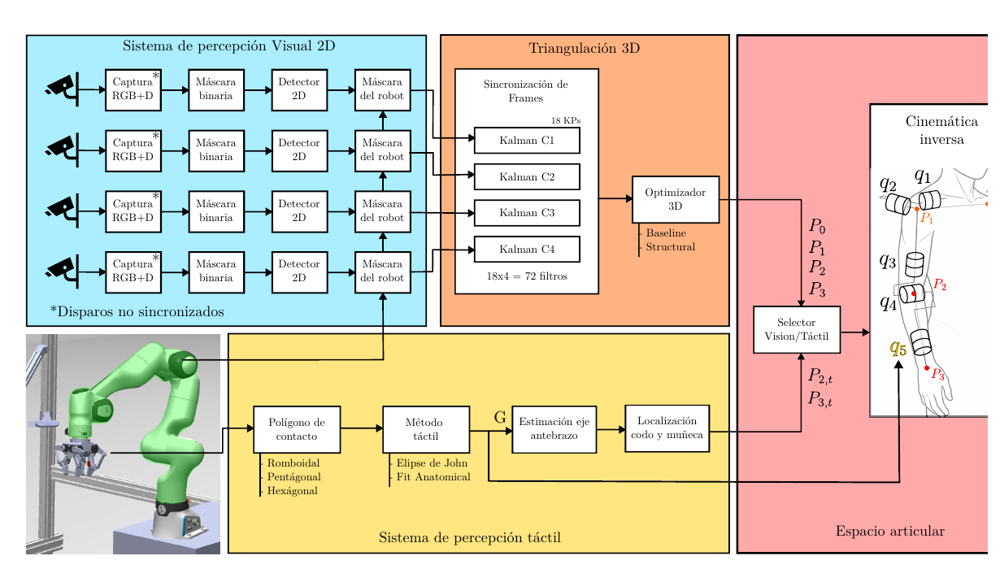
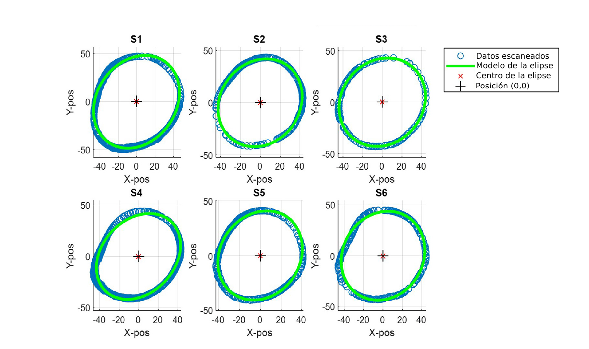
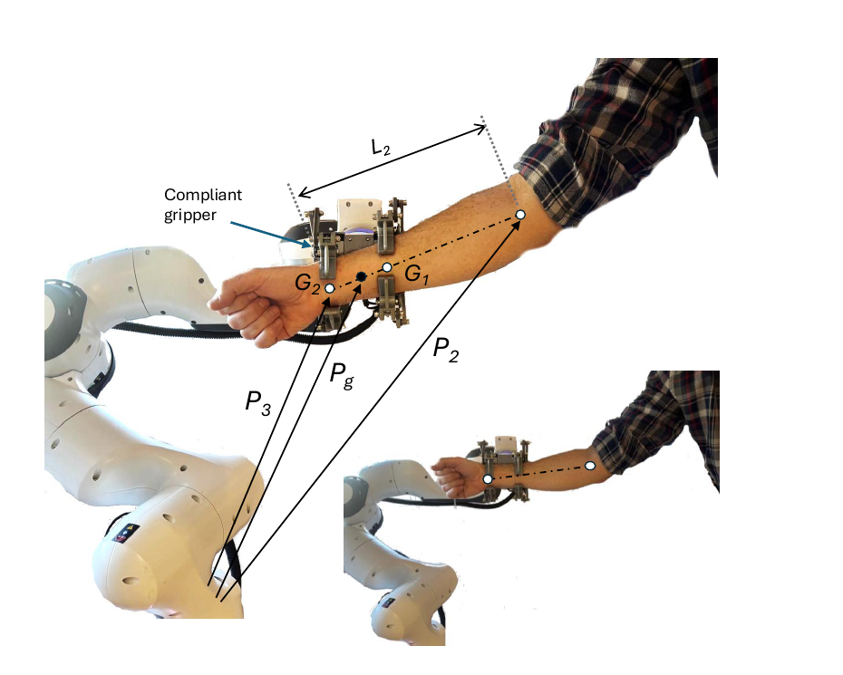
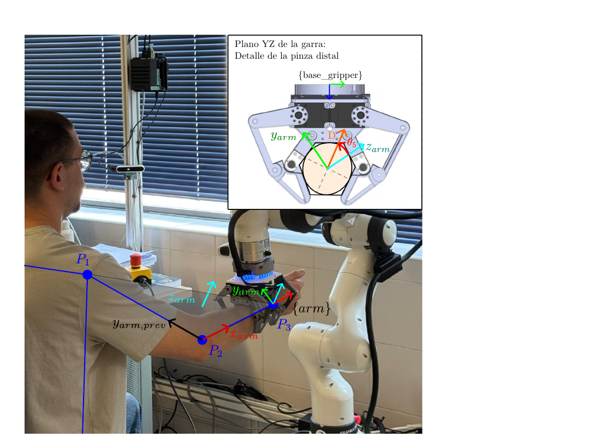

# Method: estimating forearm roll (q5) from gripper proprioception

Condensed from the thesis §2.3 (framework) and §3.4 (method). Notation: lengths in
mm, angles in rad. Code lives in `code/estimation/`.

## 0. Rationale

Visual pose estimation cannot see forearm pronosupination — the detected skeleton
ends at the wrist, and rotation about the forearm long axis does not move the
wrist point. During a physical grasp the gripper's own kinematics give a
cross-section of the forearm, which is well modelled by an ellipse.

*Thesis fig. 3.1 — the tactile branch (yellow): contact polygon → tactile method
(John ellipse / Fit Anatomical) → forearm-axis estimation → elbow & wrist
localisation, feeding the vision/tactile selector and the inverse kinematics.*

*Thesis fig. 2.7 (adapted from ref. [4]) — the forearm cross-section at 20 % of
the radius length is modelled as an ellipse; R² 0.898–0.980 over 6 scanned
subjects.*

## 1. Contact polygon  (`gripper.py`, §3.4.1)

Per finger: proximal phalanx `L1 = 40 mm`, distal phalanx `L2 = 50 mm`, base
point `P_base`. The gripper's kinematics and dimensions are described in full
in Ruiz-Ruiz, F.J.; Ventura, J.; Urdiales, C.; Gómez-de-Gabriel, J.M.
*Compliant gripper with force estimation for physical human–robot
interaction.* Mechanism and Machine Theory, 2022, 178, 105062,
https://doi.org/10.1016/j.mechmachtheory.2022.105062 — see
[`hardware/README.md`](../hardware/README.md). `P_base` still needs
transcribing from there into `config/gripper.yaml`.

    P_joint = P_base  + [L1 cos θ1,          L1 sin θ1]
    P_tip   = P_joint + [L2 cos(θ1+θ2),      L2 sin(θ1+θ2)]

*Thesis fig. 3.5 — finger kinematic points (θ₁, θ₂ passive; θ₃ actuated), the
hexagonal contact polygon after erosion, and the maximum-area inscribed ellipse
with centre `G`.*

`(θ1, θ2)` come from the magnetic encoders on the passive phalanges. Three convex
polygon models (must be convex):

| Model | Vertices | Feasibility |
|-------|----------|-------------|
| Hexagon `H` | `{Pbase_L, Pjoint_L, Ptip_L, Ptip_R, Pjoint_R, Pbase_R}` (virtual edge between the two distal tips) | 100 % — best for the thin wrist section |
| Pentagon `P` | `{Pbase_L, Pjoint_L, Vbot, Pjoint_R, Pbase_R}`; `Vbot` = intersection of the distal phalanx lines, forced outside the gripper (`t, s > 1`, eq. 3.23) | ≈ 80 % |
| Rhombus `R` | `{Pjoint_L, Vdistal, Pjoint_R, Vproximal}` (eq. 3.25) | ≈ 80 % |

Pentagon/rhombus lose feasibility when the forearm is large or off-centre and the
distal phalanges become parallel/divergent (thesis fig. 4.12: fails mainly on
subjects S2, S3, S5).

## 2. Morphological erosion  (`erosion.py`, §3.4.2)

Vertices lie on rotation axes / link intersections; the real contact section is
smaller by the phalange thickness. Shrink the polygon by a Minkowski difference
(Shapely `buffer`, negative distance) with `d = -7.5 mm`.

## 3. Inscribed ellipse — two strategies

### 3a. John ellipse / MVIE  (`mvie.py`, §2.3.2)

Convex program on the eroded polygon's outward half-spaces `aᵢᵀx ≤ bᵢ`:

    maximise  log det(G)   over G ⪰ 0 (2×2 symmetric), c ∈ R²
    s.t.      ‖G aᵢ‖₂ + aᵢᵀ c ≤ bᵢ

Global optimum, milliseconds. Weakness: biases toward low-aspect-ratio (rounded)
ellipses; accuracy depends on how well the gripper accommodates the arm.

### 3b. Fit Anatomical  (`fit_anatomical.py`, §3.4.6)

Start from the participant's measured section `(a, b)`; keep the aspect ratio
fixed, allow an isotropic skin-deformation scale `s`. State `x = [cx, cy, θ, s]`,
`θ = q5`.

    S = diag(a·s, b·s),   G = R(θ) S R(θ)ᵀ                     (3.31–3.32)
    dᵢ = ‖G aᵢ‖₂ + aᵢᵀ c − bᵢ           (John-form slack, dᵢ ≤ 0 ⇒ inside)
    J(x) = Σᵢ L(dᵢ) + λ (s − 1)²                               (3.33)
    L(d) = 10·d²  if d > 0   (collision: hard penalty)          (3.34)
           0.5·d² if d ≤ 0   (soft attraction to the wall)
    λ = 50

Solver L-BFGS-B. Search bounds: centre within ±30 mm of the polygon centroid;
`θ` narrow band around the previous frame, else 7 uniform seeds in `[−π/2, π/2]`;
`s ∈ [0.7, 1.3]`.

## 4. Forearm axis, elbow, wrist  (`forearm_axis.py`, §3.4.4)

Two pinches 75 mm apart ⇒ ellipse centres `G1` (proximal), `G2` (distal):

    u_arm = (G1 − G2) / ‖G1 − G2‖        (3.26–3.27)
    Pg    = (G1 + G2) / 2
    P2 (elbow) = Pg − (l2 − d_grasp) · u_arm                    (3.28)
    P3 (wrist) = Pg + d_grasp · u_arm                           (3.29)

`l2` (elbow–wrist length) and the wrist position are captured during the
occlusion-free approach window (participant static: variation in a time window
below a threshold); `d_grasp = ‖Pg − wrist_stored‖`.

*Thesis fig. 3.6 — the two pinch ellipse centres `G1`, `G2` define the forearm
axis; `Pg`, elbow `P2` and wrist `P3` are placed along it.*

## 5. Pronosupination angle q5  (`pronosupination.py`, §3.4.5)

Local arm frame at the wrist by Gram–Schmidt (forearm and upper arm are not
orthogonal at the elbow):

    X_arm      = (P3 − P2)/‖·‖
    Y_arm_prev = (P1 − P2)/‖·‖
    Z_arm      = X_arm × Y_arm_prev
    Y_arm      = Z_arm × X_arm

`q5` = angle between `Y_arm` and the major diagonal `D` of the **distal** ellipse,
projected on the Y–Z plane of `{arm}`:

    φ5 = atan2(D_y, D_z),   q5 = π/2 − φ5                       (3.30)

Sign: **+ supination, − pronation**, 0 at neutral.

*Thesis fig. 3.7 — the `{arm}` frame at the wrist and, inset, the distal-pinch
Y–Z plane where `q5` is read from the angle between `Y_arm` and the ellipse major
diagonal `D`.*

### Global vs. local component

- **Global component** (§4.3.5): `q5` from the major diagonal projected in the
  `{arm}` frame; the anatomical zero is dynamic (moves with the arm).
- **Local component** (§4.4–4.5): angle between the ellipse major diagonal and
  the gripper `Z` axis. Under the reference configuration
  `q1=q2=q3=0, q4=90°` (gripper `Z` ∥ global `Z`) the global component vanishes
  and the local component equals `q5` exactly.

## 6. Temporal filtering (Experiment 3)  (§4.5)

1-D constant-velocity Kalman filter, state `[q5, q5_dot]`, process noise
`Q = 0.05` (favours smoothness; introduces mild lag under high acceleration).

## 7. Known error sources

- **Soft-tissue hysteresis + passive gripper accommodation:** skin/muscle and the
  under-actuated links absorb part of the bone rotation before it reaches the
  encoders. Visible in §4.5 as a direction-dependent error (larger on the slow
  ascending sweep). Mitigated in Experiment 2 by fully opening/closing the gripper
  between discrete captures.
- **MVIE over-rounding:** motivates the Fit Anatomical method.
- **Polygon infeasibility** for large/off-centre forearms (pentagon/rhombus).

## Quantitative validation

Experiments 2 and 3 validate this pipeline against IMU ground truth (ellipse
strategy, contact-polygon model, static vs. continuous motion). The numerical
results are reported in the accompanying journal publication (see
[`CITATION.cff`](../CITATION.cff) for how to cite once available) rather than
duplicated here.
