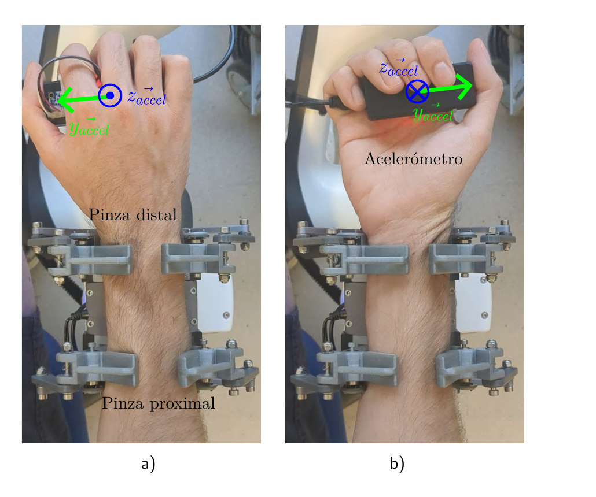

# Experimental protocols

From the thesis Chapter 4. Two experiments produce the data in this repository;
Experiment 1 (full-body pose validation with OptiTrack) is context only.

## Common environment (§4.1)

pHRI workstation: **Franka FR3** collaborative manipulator + under-actuated
gripper with two parallel pinches, grasping the participant's distal forearm;
4 extrinsically calibrated RGB-D cameras (eye-to-hand); ROS Noetic; task logic as
behavior trees (§3.5). Cartesian impedance control with low rotational stiffness
to allow angular accommodation.

## Ethics & safety (§4.2)

- Participants briefed on the collaborative-workstation safety protocols: robot
  kinematic limits (velocity, acceleration, jerk) and dynamic thresholds (joint
  torque limits, external-force detection).
- Each participant signed an **informed-consent form** authorising automated
  capture and processing of their data.
- The research team guaranteed **strict anonymisation** of all collected data in
  writing.

## Ground truth for q5

IMU / accelerometer (MPU module) held in the participant's hand, measuring the
roll angle relative to the end-effector frame:

    q5_GT = atan2(a_y, a_z) − offset − π/2                (eq. 4.1)

`a_y, a_z` = projections of gravity on the sensor axes; `offset` corrects
residual drift after a static calibration phase (sensor `Z` aligned with
gravity); the `−π/2` shift aligns GT zero with the neutral pronosupination pose.
Sign: **+ supination, − pronation, 0 at gravity alignment**. Logged over
`rosserial`, synchronised in ROS with the gripper proprioception.

## Experiment 2 — discrete captures, local q5 component (§4.4)

- **Cohort:** 9 participants (5 M, 4 F).
- **Procedure:**
  1. Grasp the accelerometer (MPU module) in the hand, starting from the neutral
     pose (0°).
  2. Rest the forearm on the base of the pinch.
  3. Static sweep in **discrete 20° increments** toward maximum pronation
     (forcing the anatomical limit at the extreme).
  4. Return to neutral; static sweep in 20° increments toward maximum supination.
  5. **The gripper is fully opened and closed between every capture** — this
     removes the soft-tissue hysteresis that builds up when the arm is rotated
     while the closed gripper presses on it.
- Extreme poses: `q5 = −90°` full pronation, `q5 = +90°` full supination.
- **Also recorded:** contact-polygon feasibility per subject and per pose
  (hexagon vs. pentagon vs. rhombus).

*Thesis fig. 4.11 — both pinches on the forearm and the hand-held accelerometer
(MPU). a) full pronation `q5 = −90°`; b) full supination `q5 = +90°`.*

## Experiment 3 — continuous captures, local q5 component (§4.5)

- Continuous angular sweep from pronation to supination, **gripper closed
  throughout**.
- Ground truth: same accelerometer setup as Experiment 2.
- Estimation: pentagon contact polygon + **Fit Anatomical**, with the ellipse
  semi-axes `(a, b)` calibrated from the participant's real forearm anthropometry.
- Temporal filter: 1-D constant-velocity Kalman, state `[q5, q5_dot]`,
  `Q = 0.05`.

## Notes for data curation

- One folder per participant, code `P01`, `P02`, … (see `../data/README.md`).
- Store the per-participant anthropometry (forearm major/minor section axes
  `a`, `b`) used to calibrate Fit Anatomical.
- Record which arm was tested and the reference joint configuration.
